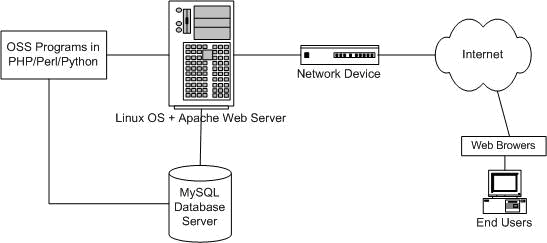
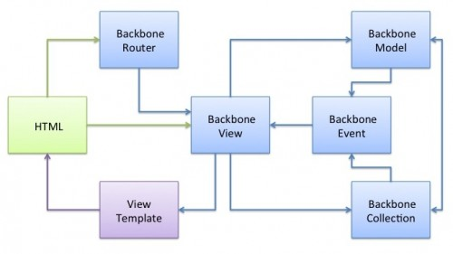
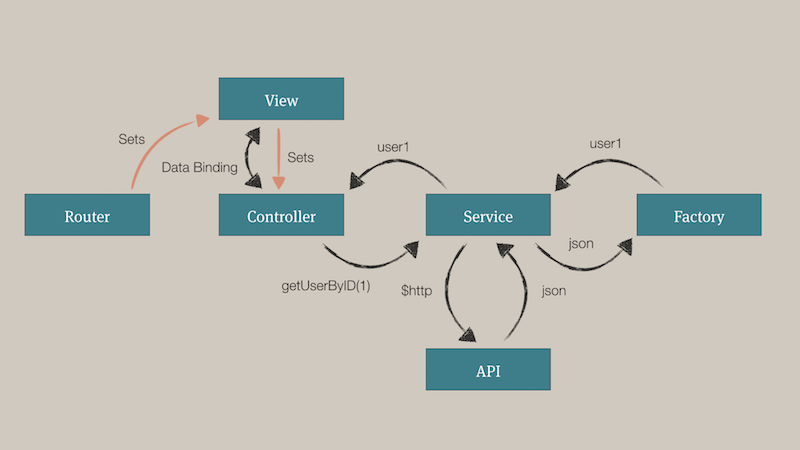
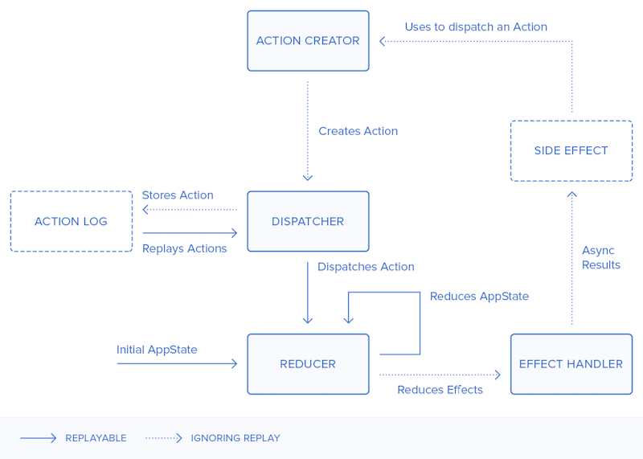

## Motivation

## 前端开发的发展历史

### 刀耕火种 - 浏览器混战，jQuery 一统天下

##### 代表类库 jquery / Prototype / Dojo

V8 出现, Chrome 和Firefox 开始瓜分IE市场
    
    
#### 发现新大陆 - Node.js 发布 前端迈向工程化 HTML5 战胜Flash
- HTML5的出现, 浏览器原生支持多媒体, video, audio标签出现
- canvas 和 svg
- css3 的出现, transition, transform
- 乔布斯宣布IOS 不支持Flash
          
#### 移动互联 - 移动设备网页开发技术兴起
- 响应式开发, 从media query 到rem
- 适应移动端框架 zepto.js, hammer.js, jquery mobile
- 移动开发难题
    - 多终端多屏幕适配
    - 手机上特有的交互, 比如召唤输入法
    - 远程调试, chrome remote debugger, weinre
#### 百家齐放
- bootstrap 组件库, 从此开发小网站成本很低
- 模块化工具, requirejs, seajs, AMD CMD CommonJS 规范
- CoffeeScript, Typescript, Javascript 预处理语言.
- 工程构建工具: FIS, Grunt, Gulp, Webpack
- CSS 预处理语言. Sass, Less
- 前端跨平台技术
    - 移动客户端 (IOS, Android)
        - PhoneGap
        - iconic
        - React-native
    - 桌面客户端
        - nwjs
- Node.js
    - Express 轻量框架
    - Ghost 博客系统
- 新一代开发框架
    - Backbone
    - Angular
    - React
    - Avalon
- 自动化测试
    - PhantomJS (命令行浏览器运行环境)
    - Mocha
- ES6 的发布
#### 工具统一 
    - 无论前后端,我们都要用npm
    - 选用支持npm的构建工具开发
    - 。。。
### 前端开发所涉及的技术，平台
#### B/S 架构
  
#### 各种各样的浏览器
- chrome
- firefox
- IE
- Opear

#### 兼容查询
[can I use](http://caniuse.com/)
    
####  页面布局技巧
- Float
- Position: absolute;
- Selector

#### 浏览器兼容性
    - IE8
        
####  http网络协议

####  用户解决开发难题的mvc和mvvm框架

##### Backbone

##### Angular

##### Flux

#### Redux

- 前端开发的主要开发工具
    - IDE webstorm
    - node.js
    - chrome 浏览器
    - chrome 开发者工具
    - 翻墙工具
    
    
- Example
[loading ball](http://codepen.io/wabeshew/pen/XdbBdM)